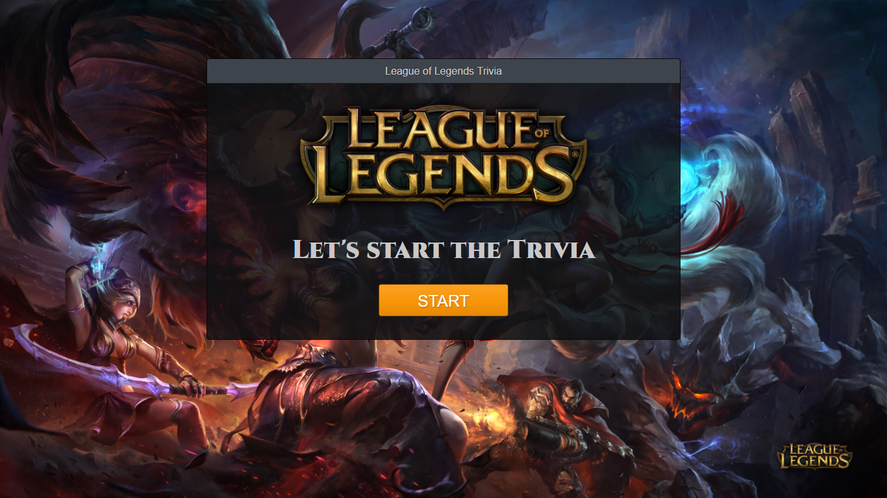

# TriviaGame
<<<<<<< HEAD

 A trivia game using JavaScript for the logic and jQuery to manipulate HTML.
 The trivia game will show one question at a time.
=======
The theme of this trivia game is base on the MOBA game League of Legends.
The Trivia game using JavaScript for the logic and jQuery to manipulate HTML.The trivia game will shows only one question until the player answers it or their time runs out.If the player selects the correct answer, show a screen congratulating them for choosing the right option. After a few seconds, display the next question. If timer runs out then the correct answer will be display and after a few seconds the next question will show up. If person answer incorrectly the incorrect screen will show up with the correct answer will appear and after a few seconds the next question will appear.The final screen, show the number of correct answers, incorrect answers, unanswer questions, and an option to restart the game.
 
Try it out your self. 
https://redpanda117.github.io/TriviaGame/

>>>>>>> 9ecd5c35fb72de4bf056badecb9dce3c8a1f639d
